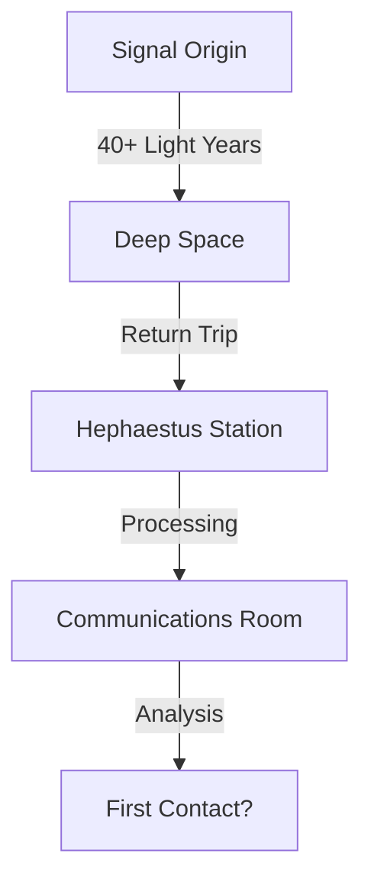

# Wolf 359 Season 1 Analysis - Deep Dive

## Command Structure & Hidden Agendas

### Official Hierarchy
1. Command (Canaveral)
2. Commander Minkowski
3. Dr. Hilbert
4. Communications Officer Eiffel
5. Hera (AI Support)

### Actual Power Structure
- Command has hidden objectives
- Hilbert operates under secret orders
- Minkowski's authority is undermined
- Hera has programming restrictions
- Eiffel discovers crucial information

> [!WARNING]
> "They knew that we might run into something out here. And they had given him orders to kill us. This wasn't just Hilbert going crazy. There's something bigger going on here." - Eiffel

## Station Incidents Chronology

| Day | Incident | Impact |
|-----|-----------|---------|
| 448 | First radio signal | Begins pattern of mysterious transmissions |
| 455 | Toothpaste rebellion | Reveals crew tension |
| 482 | Physical examinations | Shows Hilbert's manipulation |
| 490 | Project Decima begins | Secret experimentation starts |
| 512 | Hera vs Minkowski conflict | Station control issues |
| 525 | Spider discovery | Reveals hidden lab |
| 580 | Hilbert's betrayal | Major crew fracture |

## Hidden Research Projects

### Project Decima
- First mentioned in Hilbert's private log
- Involves human trials
- Connected to nicotine lozenges
- Possibly affects crew health

### Specimen 34
- Plant-based experiment
- Shows signs of intelligence
- Can control/possess humans
- Lives in ventilation system

### Hidden Laboratory Research
- Genetic experiments on spiders
- Previous mission involvement
- Connected to Captain Lovelace
- Dangerous specimens

## Radio Signal Analysis

### Characteristics
- Old Earth broadcasts (1910s-1920s)
- Classical and period music
- Return journey vs. direct transmission
- Possible alien origin

### Signal Pattern

## Psychological Elements

### Personal Isolation
> "Am I alone now?" - Multiple characters

Each character experiences isolation differently:
- Eiffel: Uses humor as defense
- Minkowski: Maintains rigid control
- Hilbert: Embraces solitude
- Hera: Questions her existence

### Crew Mental States

| Character | Coping Mechanism | Breaking Point |
|-----------|------------------|----------------|
| Eiffel | Humor, rebellion | Box 953 mystery |
| Minkowski | Control, protocol | Crew betrayal |
| Hilbert | Work, detachment | Alien contact |
| Hera | Duty, friendship | Programming conflicts |

## Station Security Systems

### Access Levels
1. Command Override Codes
2. Commander Authorization
3. Emergency Protocols
4. Standard Access
5. Restricted Areas

### Emergency Protocols
- Protocol 24C: Station lockdown
- Protocol M: Power control
- Override-34-Stroke-C: Fire control
- Emergency Code Alpha Victor: AI control

## Unexplained Elements

> [!NOTE]
> Key mysteries remaining at season end:
> 1. Box 953's contents
> 2. True nature of radio signals
> 3. Command's real objectives
> 4. Captain Lovelace's fate
> 5. Extent of Hilbert's experiments

### Technical Mysteries
1. Station's shifting architecture
2. Hidden laboratory origin
3. Hera's true capabilities
4. Specimen 34's nature
5. Previous mission details

